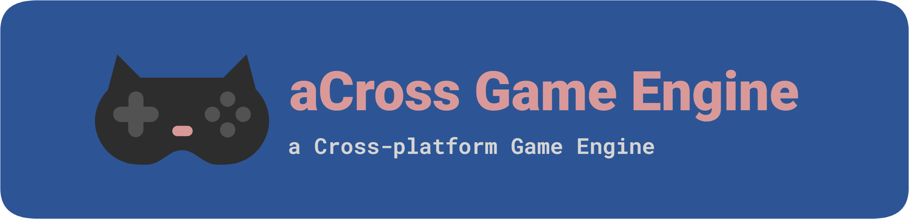

aCross is a soon-to-be a game engine, currently under expirmentation, planning, and development.

## Q & A:

| Question                                  | Answer                                                 |
| ----------------------------------------- | ------------------------------------------------------ |
| "What is this?"                           | "No."                                                  |
| "Where is most of the actual source code? | "Yes."                                                 |
| "Why is the Q & A like this?"             | "Yes."                                                 |
| "ANSWER THE QUESTIONS PROPERLY!"          | "No."                                                  |
| "Official website?"                       | https://across.ehan.dev/                               |
| "Website source code?"                    | https://github.com/aCross-Game-Engine/across.ehan.dev/ |

Don't question it.
